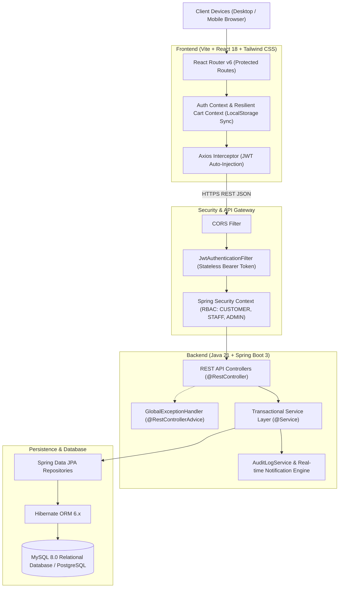
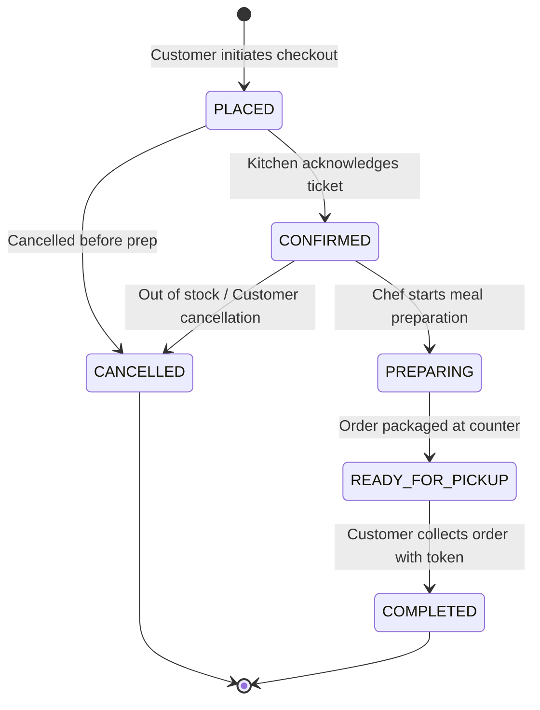

# System Architecture & Technical Design

## 1. System Overview

**CanteenHub** is an enterprise-grade full-stack digital canteen management and food ordering platform designed for high-concurrency educational and corporate campuses. It automates menu management, kitchen queuing, live order preparation tracking, inventory decrementing, coupon validation, and administrative analytics.

---

## 2. High-Level Architecture

---

## 3. Technology Stack

### Backend Architecture
- **Language**: Java 21 (LTS)
- **Framework**: Spring Boot 3.2.3
- **Security**: Spring Security 6 with BCrypt password hashing & JJWT (JSON Web Token)
- **Data Access**: Spring Data JPA, Hibernate ORM
- **Database**: MySQL 8.0 with InnoDB engine, transactional foreign keys, and indexes
- **Documentation**: SpringDoc OpenAPI 3 / Swagger UI
- **Testing**: JUnit 5, Mockito

### Frontend Architecture
- **Framework**: React 18 with TypeScript
- **Build Tool**: Vite 5
- **Styling**: Tailwind CSS with custom design system
- **Routing**: React Router DOM v6
- **State Management**: React Context API (`AuthContext`, `CartContext`) with local storage dual-sync
- **Icons & Charts**: Lucide React, Recharts

---

## 4. Layered Design Pattern

The platform strictly adheres to the **Controller-Service-Repository-DTO** pattern:

1. **Controller Layer (`com.canteen.controller`)**:
   - Handles incoming HTTP requests, route binding, and status code mapping.
   - Enforces `@Valid` input validation constraints.
   - Extracts `@AuthenticationPrincipal` for secure user identification.
   - Returns typed `ResponseEntity<T>` with DTO payloads.

2. **Service Layer (`com.canteen.service`)**:
   - Encapsulates all transactional business rules (`@Transactional`).
   - Validates inventory stock levels before order completion.
   - Executes multi-step workflows (e.g. order placement + stock deduction + cart purge + audit logging + notification dispatch).

3. **Repository Layer (`com.canteen.repository`)**:
   - Extends `JpaRepository<T, ID>` with custom JPQL queries and pagination (`Pageable`).
   - Uses optimized indexed lookups to prevent N+1 query overhead.

4. **Exception Handling Layer (`com.canteen.exception`)**:
   - Centralized `@RestControllerAdvice` intercepts `ResourceNotFoundException`, `BadRequestException`, `AccessDeniedException`, and validation errors.
   - Outputs unified, production-safe JSON response payloads.

---

## 5. Security & RBAC Model

| Role | Permissions & Access Scope |
|---|---|
| `ROLE_CUSTOMER` | Browse menu, search items, manage cart, apply coupons, checkout, track active orders, view past order history, update profile. |
| `ROLE_STAFF` | Access kitchen queue, view live pending orders, advance preparation steps (`CONFIRMED` &rarr; `PREPARING` &rarr; `READY_FOR_PICKUP` &rarr; `COMPLETED`). |
| `ROLE_ADMIN` | Full control: Menu management (CRUD), Category creation, Inventory tracking & stock alerts, Coupon creation, User role management, Revenue analytics, and Audit logs. |

---

## 6. Order Lifecycle State Machine

