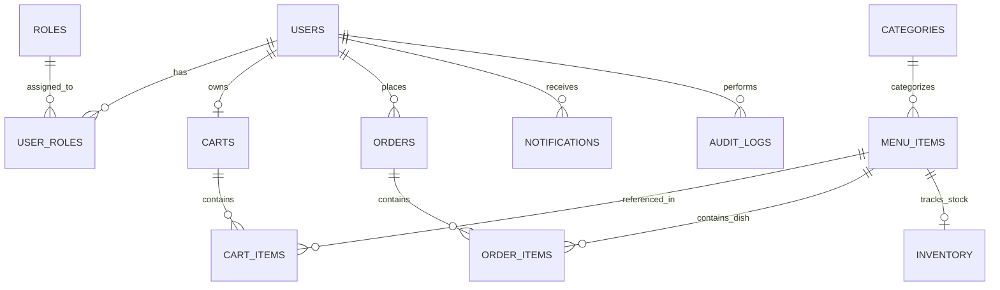

# Relational Database Design & Schema Architecture

## 1. Entity-Relationship Diagram

---

## 2. Table Specifications & Indexes

### `users`
| Column | Type | Constraints | Description |
|---|---|---|---|
| `id` | BIGINT | PRIMARY KEY AUTO_INCREMENT | Unique user identifier |
| `name` | VARCHAR(100) | NOT NULL | User full name |
| `email` | VARCHAR(100) | NOT NULL UNIQUE INDEX | Authentication email |
| `phone` | VARCHAR(20) | NULL | Contact phone number |
| `password` | VARCHAR(255) | NOT NULL | BCrypt hashed password string |
| `enabled` | BOOLEAN | NOT NULL DEFAULT TRUE | Account active/disabled flag |
| `created_at` | TIMESTAMP | DEFAULT CURRENT_TIMESTAMP | Registration timestamp |

### `roles` & `user_roles`
| Column | Type | Constraints |
|---|---|---|
| `id` | BIGINT | PRIMARY KEY |
| `name` | VARCHAR(50) | NOT NULL UNIQUE (`ADMIN`, `STAFF`, `CUSTOMER`) |

### `categories`
| Column | Type | Constraints | Description |
|---|---|---|---|
| `id` | BIGINT | PRIMARY KEY AUTO_INCREMENT | Category ID |
| `name` | VARCHAR(100) | NOT NULL UNIQUE | Category name (Breakfast, Lunch, Snacks, etc.) |
| `description` | TEXT | NULL | Category description |
| `active` | BOOLEAN | NOT NULL DEFAULT TRUE | Active display toggle |

### `menu_items`
| Column | Type | Constraints | Description |
|---|---|---|---|
| `id` | BIGINT | PRIMARY KEY AUTO_INCREMENT | Menu item ID |
| `name` | VARCHAR(150) | NOT NULL INDEX | Item name |
| `description` | TEXT | NULL | Dish description & ingredients |
| `price` | DECIMAL(10,2) | NOT NULL INDEX | Price in INR |
| `category_id` | BIGINT | FOREIGN KEY &rarr; `categories(id)` | Linked category |
| `image_url` | VARCHAR(500) | NULL | High-resolution dish photography |
| `available` | BOOLEAN | NOT NULL DEFAULT TRUE INDEX | In-stock toggle |
| `vegetarian` | BOOLEAN | NOT NULL DEFAULT TRUE | Pure veg flag |
| `rating` | DECIMAL(2,1) | DEFAULT 4.5 | Average rating score |
| `rating_count` | INT | DEFAULT 0 | Total reviews count |
| `preparation_time` | INT | DEFAULT 10 | Estimated minutes |

### `orders`
| Column | Type | Constraints | Description |
|---|---|---|---|
| `id` | BIGINT | PRIMARY KEY AUTO_INCREMENT | Order ID |
| `order_number` | VARCHAR(50) | NOT NULL UNIQUE INDEX | Human readable order reference |
| `user_id` | BIGINT | FOREIGN KEY &rarr; `users(id)` | Order owner |
| `status` | VARCHAR(30) | NOT NULL INDEX | `PLACED`, `CONFIRMED`, `PREPARING`, `READY_FOR_PICKUP`, `COMPLETED`, `CANCELLED` |
| `total_amount` | DECIMAL(10,2) | NOT NULL | Subtotal amount |
| `discount_amount`| DECIMAL(10,2) | DEFAULT 0.00 | Applied coupon deduction |
| `tax_amount` | DECIMAL(10,2) | NOT NULL | 5% GST calculation |
| `final_amount` | DECIMAL(10,2) | NOT NULL | Total paid amount |
| `coupon_code` | VARCHAR(50) | NULL | Applied promo voucher |
| `payment_method`| VARCHAR(30) | NOT NULL | `UPI`, `CARD`, `CASH_ON_PICKUP`, `ONLINE` |
| `payment_status`| VARCHAR(30) | NOT NULL | `COMPLETED`, `PENDING`, `FAILED`, `REFUNDED` |
| `created_at` | TIMESTAMP | DEFAULT CURRENT_TIMESTAMP INDEX | Order placement time |

### `order_items`
| Column | Type | Constraints | Description |
|---|---|---|---|
| `id` | BIGINT | PRIMARY KEY AUTO_INCREMENT | Order item ID |
| `order_id` | BIGINT | FOREIGN KEY &rarr; `orders(id)` ON DELETE CASCADE | Parent order |
| `menu_item_id` | BIGINT | FOREIGN KEY &rarr; `menu_items(id)` | Ordered dish |
| `item_name` | VARCHAR(150) | NOT NULL | Snapshot of item name |
| `unit_price` | DECIMAL(10,2) | NOT NULL | Snapshot of unit price |
| `quantity` | INT | NOT NULL | Quantity ordered |
| `total_price` | DECIMAL(10,2) | NOT NULL | Line item total |

### `inventory`
| Column | Type | Constraints | Description |
|---|---|---|---|
| `id` | BIGINT | PRIMARY KEY AUTO_INCREMENT | Inventory ID |
| `menu_item_id` | BIGINT | UNIQUE FOREIGN KEY &rarr; `menu_items(id)` | Linked menu item |
| `quantity` | INT | NOT NULL | In-stock quantity count |
| `unit` | VARCHAR(30) | NOT NULL | `plates`, `cups`, `glasses`, `pieces` |
| `min_stock_level`| INT | NOT NULL DEFAULT 10 | Low stock warning trigger |

### `coupons`
| Column | Type | Constraints | Description |
|---|---|---|---|
| `id` | BIGINT | PRIMARY KEY AUTO_INCREMENT | Coupon ID |
| `code` | VARCHAR(50) | NOT NULL UNIQUE INDEX | Promo voucher code (`WELCOME10`, `SAVE20`) |
| `discount_percent`| DECIMAL(5,2)| NOT NULL | Percentage discount |
| `max_discount` | DECIMAL(10,2)| NULL | Cap on discount amount |
| `min_order_amount`| DECIMAL(10,2)| DEFAULT 0.00 | Minimum order subtotal |
| `expiry_date` | DATE | NOT NULL | Campaign end date |
| `usage_limit` | INT | NULL | Global max redemptions |
| `used_count` | INT | DEFAULT 0 | Current redemption count |
| `active` | BOOLEAN | NOT NULL DEFAULT TRUE | Active campaign flag |
